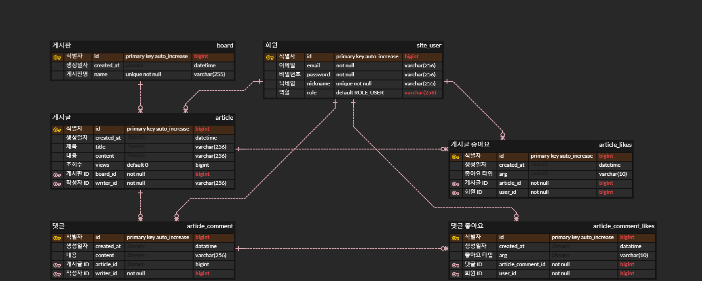

# chirp-community

# 📌 프로젝트 개요

> 게임 관련 커뮤니티 사이트.
운영자는 게시판을 만들 수 있고 모든 게시물을 삭제할 권한을 가지고 있습니다.
사용자는 이메일 인증 이후, 게시물 작성, 댓글 작성 등등을 수행할 수 있습니다.
> 

# 📌 개발 세부 스택

- Spring Web
- Spring Data JPA
- Spring Security
- Json Web Token
- Lombok
- H2 Database
- MySQL Driver

- Docker
- Docker Compose

- React
- Redux

# 📌 주요 성과

- 서버 최적화 수행 이전에 어떤 API가 실행 속도를 많이 차지하는지 확인 필요.
    - AOP를 이용해서 각 API 요청마다 **실행시간 측정 및 로깅, 🔗[시각화](https://github.com/chirp-community/chirp-community-analytic-tools/blob/main/analyze_avg_runtime.ipynb)**
- 이전 프로젝트에서 수많은 컴포넌트로 인한 유지 보수성 저하
    - React 중 컴포넌트의 재활용성을 높이기 위해 
    **UI 컴포넌트와 API 호출 컴포넌트를 분리**.
- Login 컴포넌트 State 변화의 Header 컴포넌트로의 전달 불가 문제.
    - Redux를 이용하여 인증 완료 시, 모든 컴포넌트에 상태 변화를 알림.

# 📌 프로젝트 아키텍처

# 📌 ER Diagram

